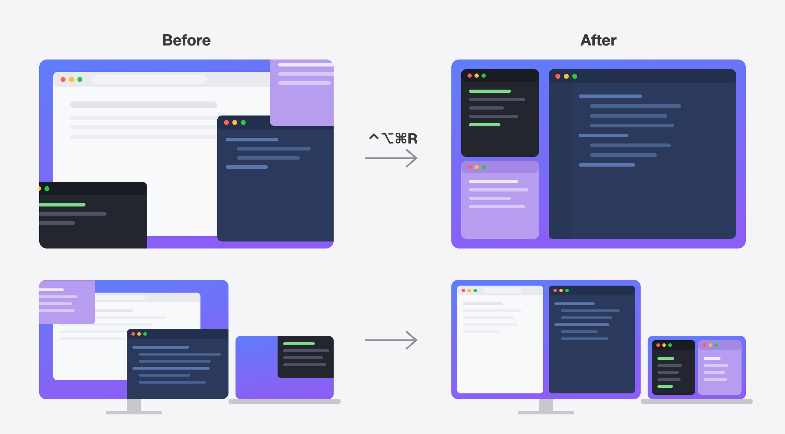

# RestoreLayout

A macOS menu bar app that puts your windows back where you keep them. One
shortcut (`⌃⌥⌘R`) restores a saved layout after a monitor unplug or a
maximized window scrambles everything.



## Why

On a laptop screen my layout is always the same: terminal and notes stacked in
a narrow column on the left, editor and browser filling the rest. macOS
forgets it. Unplug an external monitor and every window lands somewhere
random, then you rebuild the arrangement by hand. RestoreLayout snapshots the
arrangement once and puts it back on demand.

It keeps a laptop layout plus one multi-display layout for each set of
displays you dock to. Saving again overwrites the slot for the displays
connected right now.

## Install

Requires macOS 14+ and the Swift toolchain (Xcode Command Line Tools is
enough).

```sh
git clone https://github.com/hunterphillips/restore-layout.git
cd restore-layout
./make-dev-cert.sh        # one time: create a stable local signing identity
./build-app.sh install    # build, copy to /Applications, launch
```

`make-dev-cert.sh` creates a self-signed certificate so rebuilds keep their
Accessibility approval. Without it the build falls back to ad-hoc signing, and
on macOS Tahoe each ad-hoc rebuild needs Accessibility granted again.

On first launch, macOS asks for **Accessibility** access (System Settings →
Privacy & Security → Accessibility). The menu unlocks once it's granted. For
CLI use, the terminal running the binary needs its own Accessibility grant.

## Use

- Arrange your windows, then press `⌃⌥⌘S` or choose **Save Current Layout**.
  With only the laptop screen connected this saves the laptop layout;
  otherwise it saves the multi-display layout for the connected displays.
- Choose **Restore Laptop Layout** or **Restore Multi-Display Layout** to put
  everything back. The multi-display item is enabled only when external
  displays are connected and a layout exists for that set.
- Press `⌃⌥⌘R` to restore whatever the **Restore Shortcut** submenu says:
  **Auto-detect** (the default), **Laptop Layout**, or **Multi-Display
  Layout**. Auto-detect picks the multi-display layout for the connected
  displays if one exists, otherwise the laptop layout.
- Click the menu bar icon for the menu, when each layout was saved, and the
  **Launch at Login** toggle.

Restoring the laptop layout also works while docked, as long as the lid is
open (clamshell mode has no built-in display to place windows on): it gathers
every window onto the laptop screen, so you can pull the cable afterwards.

## CLI

The same binary runs headless:

```sh
RestoreLayout --save              # save to the slot for the connected displays
RestoreLayout --restore           # restore what the shortcut would
RestoreLayout --restore laptop    # restore the laptop layout
RestoreLayout --restore multi     # restore the layout for the connected displays
RestoreLayout --list              # print displays, then windows and frames
```

`--save` prints which slot it wrote. `--list` shows each connected display
with its UUID, then each window with its anchor display and its frame
relative to that display.

Layouts and the shortcut setting are plain JSON at
`~/Library/Application Support/RestoreLayout/layouts.json`. A v1
`layout.json` in the same folder is migrated into the laptop slot on first
load and left in place.

## How it works

Save reads the Accessibility window list of every regular app and records each
visible, standard, non-minimized window's frame as an offset from the top-left
corner of its anchor display: the display the window overlaps most. A laptop
layout is one where every window anchors to the built-in display.

Displays are identified by the UUID macOS assigns them. At restore each saved
display is matched to a live one by UUID first, then by vendor, model, and
size in points (a monitor with a junk serial can change UUID when it moves
ports), and finally falls back to the built-in display. Windows whose display
can't be resolved at all are skipped. Frames are applied as saved; if a
display's size changed, restore reports a warning rather than scaling.

Restore pairs saved and live windows by app and window order, never by title
(browser tab titles change constantly). It applies each frame as
size → position → size, because macOS otherwise clamps windows to fit whatever
display they currently occupy, then reads the frame back and retries briefly
on a mismatch. Chromium apps get `AXEnhancedUserInterface` disabled during the
move; with it on, a single resize can stall Chrome for seconds.

Restore skips minimized and fullscreen windows, windows on other Spaces
(macOS offers no public API for those), apps that aren't running, and windows
opened after the save. A skip never aborts the rest of the restore.

## Development

```sh
swift build && swift test   # unit tests cover coordinates, matching, persistence,
                             # display resolution, and target selection
./build-app.sh              # assemble and sign the bundle in place
./test-restore.sh           # optional smoke test; needs Accessibility access
```

## Roadmap

Planned: an opt-in trigger that restores automatically when the display
configuration changes. It would call the same resolver as **Layout for
Connected Displays**. Today the app does no display watching at all.

## License

MIT
